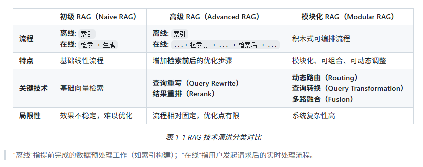
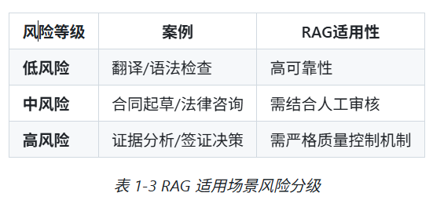

# 什么是RAG？
## 1.1 核心定义
RAG，全称为 Retrieval-Augmented Generation.

是一种解决大语言模型“知其然不知其所以然”问题的**技术范式**，核心是把模型内部学到的“参数化知识”和来自外部知识库的“非参数化知识”相结合。  
- 参数化知识：模型通过学习得到的权重，类似于人类大脑中模糊的记忆  
- 非参数化知识：来源于可靠的外部知识库，内容精确，是可随时更新的外部数据

运作逻辑：  
- 在LLM生成文本之前，先通过 **检索机制** 从外部知识库中动态地获取相关信息，并将这些参考资料融入文本生成的过程，提升输出文本的准确性和时效性

> RAG 就像给正在学习的小孩（模型）一个课本（外部知识库），让他学习到的内容是有依据的，可靠的

## 1.2 技术原理
RAG 实现两种知识的结合过程分为两个阶段：

1. 检索阶段：“寻找非参数化知识“  
   - 知识向量化：embedding， 把知识库里的内容编码为向量索引（转化为计算机可以处理的形式），存入一个**向量数据库**
   - 语义召回：根据用户发起的查询，对应的检索模块同样先把查询的**问题向量化**，通过**相似度搜索**，从向量数据库中锁定与问题向量最相关的文档片段

2. 生成阶段：两种知识的融合
   - 整合上下文：有一个生成模块，接受检索阶段输出的**相关文档片段**和用户的**原始问题**  
   - 生成引导指令：生成模块会遵循预先设置好的 **Prompt** 指令，将上下文与问题有效整合，然后引导对应的LLM进行文本生成，确保文本的可控和有理有据

## 1.3 技术演进分类

演进的趋势基本上是：复杂度增加、模块化组合编排，索引过程更复杂

# 二、为什么要使用RAG？

## 2.1 技术选型 RAG vs 微调

大模型的应用过程中，选择具体的技术路径需要考量 成本与效益 的平衡，优先考虑：对模型改动最小、成本最低的方案。

一般的技术选型路径：  
**提示词工程（Prompt Engineering） -> 检索增强生成 -> 微调（Fine-tuning）**

上述技术实际是两个维度的优化：  
- 一种是横轴的“LLM优化”，指的是针对模型本身参数和权重的修改程度  
- 一种是纵轴的“上下文优化”，指的是对输入模型的信息的增强程度

PS：提示工程仅仅优化了提问方式，在输入信息的增强程度上比较弱，但RAG引入外部知识库则极大丰富了上下文信息 

技术选型的尝试过程（由浅入深）：  
1. 先尝试提示工程：适用于**任务简单、模型已有相关知识**的场景  
2. 再应用RAG：适用于模型**缺乏特定信息或实时知识**的场景，使用RAG给模型 *“开外挂”* ，补充这些模型缺乏的上下文信息   
3. 最后考虑微调：微调的**工程量大、改动精细**，适用于需要**改变模型行为、风格、格式**的场景。
   - 这种场景就不是简单的输出知识和答案，而是让模型学会严格遵循某种独特的输出格式、模仿特定的语言风格等

## 2.2 关键优势
1. 准确性与可信度双重提升  
最核心价值：突破模型与训练知识的限制（知识库开外挂）  
- 补充专业领域知识盲区  
- 有效抑制幻觉现象（一本正经胡说八道）
- 输出更具体、更多样、可溯源（没一条回答都能找到在知识库中的出处）
  - 提高在法律、医疗等**严肃场景**下的可信度
  - *严肃场景的应用才使得AI能够成为真正落地的工具！*

2. 时效性保障：  
   引入外部知识库实现模型输入的”动态更新“，相当于给模型补充训练截止日期之后的实时信息 —— **“索引热拔插”（Index Hot-swapping）**

3. 综合成本效益显著：  
   处于提示工程（上下文信息不够丰富）和微调（巨额算力成本）中间的**高性价比**方案

4. 模块化灵活可扩展  
   多源数据集成：PDF、Word、网页等等，可以独立优化针对不同源数据的检索组件，是和长期迭代

# 三、怎么构建RAG？

## 3.1 基础工具链选择
几个关键环节选型：    

开发模式：
- LangChain 或 LlamaIndex 等成熟框架快速集成  
- 借助AI辅助进行原生开发  

记忆载体（向量数据库）：  
- 大规模数据：Milvus、Pinecone 
- 轻量级/本地化：FAISS、Chroma

自动评估工具：
- RAGAS 或 TruLens 等

## 3.2 四步构建最小可行系统MVP
最小可行产品 minimum viable product  
1. 数据清洗：PDF、Word 等多源异构数据标准化，合理分块，避免信息被分割的支离破碎（分出tokens）
2. 构建索引：把切分好的文本通过embedding转化为向量，存入数据库。实现元数据（来源、页码）的关联  
3. 优化检索策略：混合检索（向量+关键词）提升召回率，重排序模型对检索结果进行二次精选  
4. 生成与提示词工程：保证Prompt模板足够清晰，明确要求模型“不知道就说不知道”，防止幻觉

快速上手（可视化知识库平台）：FastGPT 或 Dify  
开发模板：LangChain4j Easy RAG 或 GitHub 上的 TinyRAG

## 3.3 评估维度
一套RAG系统的好坏需要标准的量化评估  

- 检索相关性：找到的内容是否包含答案
- 生成质量：语义准确性（回答的意思是不是正确）+ 词汇匹配度（专业术语是否使用得当）

当前RAG的输出结果好坏很大程度上依赖于检索质量的高低，如果检索系统召回了错误信息，那么再强的LLM也很容易出现幻觉

而且面对需要在多个文档之间进行综合分析的场景**（多跳推理）**，普通的RAG架构也难以应对